# 🎓 Training Management Platform

> A comprehensive multi-tenant training management system built with Flutter and Firebase, featuring role-based access control, gamification, real-time chat, and AI-powered anomaly detection.

<div align="center">


</div>

---

## 📚 UI/UX Improvement Documentation

**NEW**: Comprehensive UI/UX enhancement project in progress! 🎨

### 📄 Essential Files

- **[UI_UX_IMPROVEMENT_PLAN.md](./UI_UX_IMPROVEMENT_PLAN.md)** - Complete roadmap with 8 phases, code examples, and checklists
- **[UI_UX_NEXT_PHASE_CHECKLIST.md](./UI_UX_NEXT_PHASE_CHECKLIST.md)** - Master checklist with detailed progress tracking
- **[PROGRESS_TRACKING.md](./PROGRESS_TRACKING.md)** - Daily progress tracking, statistics, and lessons learned
- **[DESIGN_SYSTEM_QUICK_REF.md](./DESIGN_SYSTEM_QUICK_REF.md)** - Quick reference for Design Tokens (colors, typography, spacing)

**Current Status** (October 22, 2025):
- ✅ Phase 1: Design System (100% complete)
- ✅ Phase 2: Authentication Screens (100% complete)
- ✅ Phase 3: Main Screens (100% complete)
- 🔄 Phase 4: Content Creation Screens (37% - 2/6 complete)
  - ✅ Create Module Screen (360 lines)
  - ✅ Create Course Screen Enhanced (826 lines)
  - ⏳ Create Lesson Screen (Next)

**Progress**: 45% overall (70/249 tasks complete)

---

## 📋 Table of Contents

- [Overview](#-overview)
- [Key Features](#-key-features)
- [Tech Stack](#-tech-stack)
- [User Roles](#-user-roles)
- [Screenshots](#-screenshots)
- [Demo Video](#-demo-video)
- [Architecture Highlights](#-architecture-highlights)
- [Contact](#-contact)

---

---

## 🎯 Overview

## ✨ Features

**Training Management Platform** is a full-stack mobile and web application designed for educational institutions, training centers, and corporate learning departments. It provides a complete ecosystem for managing courses, trainers, trainees, and tracking learning progress with advanced gamification and analytics.

### 🏫 Core Features

### 🌟 What Makes It Special?- **User Management**: Role-based access (Trainee, Trainer, Manager, Super Admin)

- **Course Management**: Create, join, and manage training courses

- **Multi-Tenant Architecture**: Supports institutions → companies → departments hierarchy- **Department & Team System**: Organizational structure support

- **6 User Roles**: Super Admin, Org Admin, Company Admin, Manager, Trainer, Trainee- **Teaching Assignments**: Assign trainers to courses

- **Real-Time Features**: Live chat, notifications, course walls with instant updates- **Resource Library**: Upload and share course materials

- **Gamification Engine**: Points, badges, levels, streaks, leaderboards- **Quiz System**: Create and take quizzes with auto-grading

- **AI Anomaly Detection**: ML-based cheating and suspicious activity detection- **Evaluation System**: Rate trainers and provide feedback

- **Enterprise-Grade Security**: Firestore rules, role-based access, tenant isolation

### 💬 Course Wall (Advanced)

---- **Rich Posts**: Text, images (single/multiple), and polls

- **Interactive Polls**: Single/multiple vote modes with real-time results

## ✨ Key Features- **Reactions**: Emoji reactions on posts

- **Comments**: Threaded discussions with reactions

### 👥 User Management- **Pinned Posts**: Important announcements stay at top

- ✅ **Multi-Tenant Support**: Institutions, companies, departments hierarchy- **Search & Filter**: 

- ✅ **Role-Based Access Control (RBAC)**: 6 distinct user roles with granular permissions  - Text search (content, authors, emails)

- ✅ **SSO Integration**: Google Sign-In, Apple Sign-In  - Filter by post type (text/images/polls)

- ✅ **HRIS Import**: Bulk user import via CSV/Excel with mapping wizard  - Filter by author

- ✅ **User Profiles**: Customizable profiles with avatars, bios, job titles  - Date range filtering

  - Sort by newest/oldest/comments/reactions

### 📚 Course Management- **Pagination**: Infinite scroll support

- ✅ **Course Creation**: Rich course builder with multimedia support

- ✅ **Lesson Management**: Video, audio, PDF, documents, quizzes### 🔔 Push Notifications

- ✅ **Enrollment System**: Join codes, auto-enrollment, approval workflows- Real-time notifications via OneSignal

- ✅ **Progress Tracking**: Real-time completion rates, time tracking- Notifications for new posts in enrolled courses

- ✅ **Certificates**: Auto-generated completion certificates- Backend-based notification delivery

- Multi-user targeting support

### 💬 Communication & Collaboration

- ✅ **Course Wall**: Facebook-style posts with reactions, comments, polls### 🎮 Gamification System

- ✅ **Real-Time Chat**: Direct messages and course group chats- **Points**: Earn points for completing lessons, quizzes, and maintaining streaks

- ✅ **Notifications**: Push notifications via OneSignal- **Badges**: Achievement system with multiple tiers

- ✅ **@Mentions**: Tag users in posts and comments- **Levels**: Dynamic leveling based on total points

- ✅ **Rich Media**: Images, videos, files sharing- **Daily Streaks**: Encourage daily engagement

- **Leaderboard**: Compete with other learners

### 🎮 Gamification System- **Timeline**: Track your badge achievements

- ✅ **Points System**: Earn points for lessons, quizzes, daily streaks

- ✅ **Levels**: Progressive leveling based on total points### 🔒 Security

- ✅ **Badges**: 6 badge families with 30+ unique achievements- Firebase Authentication integration

- ✅ **Leaderboards**: Course, institution, and global rankings- Role-based access control

- ✅ **Daily Streaks**: Consecutive day activity tracking- Firestore security rules

- Data validation and sanitization

### 📊 Analytics & Reporting

- ✅ **Dashboards**: Role-specific dashboards with key metrics### 🌐 Advanced Features

- ✅ **Progress Reports**: Individual and group progress tracking

- ✅ **Quiz Analytics**: Score distributions, pass rates, time analysis#### 🔑 SSO Integration

- ✅ **Engagement Metrics**: Active users, popular courses, completion rates- **Google Sign-In**: OAuth 2.0 authentication

- ✅ **Export Options**: PDF and Excel report generation- **Apple Sign-In**: Sign in with Apple support

- Email authentication as fallback

### 🛡️ Security & Compliance- Auto-provisioning of user profiles

- ✅ **Firestore Security Rules**: 1000+ lines of granular access control

- ✅ **Tenant Isolation**: Data segregation by institution/company#### 📊 HRIS Import (HR Information System)

- ✅ **Anomaly Detection**: ML-based cheating detection (Z-score algorithms)- **Bulk User Import**: CSV & Excel file support

- ✅ **Audit Logging**: Complete activity tracking- **Flexible Mapping**: Custom column mapping wizard

- ✅ **Data Privacy**: GDPR-ready data handling- **Validation**: Email format, required fields, duplicate detection

- **Progress Tracking**: Real-time import progress

### 🎨 User Experience- **Error Handling**: Detailed error reports per user

- ✅ **Responsive Design**: Works on mobile, tablet, desktop- **Templates**: Save and reuse mapping configurations

- ✅ **Light/Dark Mode**: Full theme support with smooth transitions- **History**: View all import jobs with status and statistics

- ✅ **RTL Support**: Arabic and English with proper text direction

- ✅ **Offline Mode**: Cache and sync for offline learning#### 📈 BigQuery Export

- ✅ **Accessibility**: Screen reader support, high contrast- **Data Export**: Users, courses, analytics data

- **Scheduling**: Manual, daily, weekly, monthly exports

---- **Job Tracking**: Monitor export status and progress

- **Configuration**: Project ID, dataset ID, credentials

## 🛠️ Tech Stack- **History**: View all export jobs with row counts

- Note: BigQuery API integration ready (requires google_cloud package)

### Frontend

- **Framework**: Flutter 3.9.2+ (Dart 3.0+)#### 🤖 ML Anomaly Detection

- **State Management**: Riverpod 2.5.1- **Statistical Analysis**: Z-score based detection algorithms

- **Navigation**: GoRouter with deep linking- **6 Detection Types**:

- **Local Storage**: SharedPreferences, Hive  * Unusual quiz scores (cheating detection)

- **Networking**: Dio with retry logic  * Suspicious login patterns

- **Image Handling**: Cached Network Image, Image Picker  * Rapid progress (unrealistic speed)

- **Animations**: Lottie, custom Hero animations  * Multiple failed attempts

  * Unusual access patterns

### Backend  * Data inconsistency

- **Database**: Cloud Firestore (NoSQL)- **Real-time Monitoring**: Live anomaly dashboard

- **Authentication**: Firebase Auth (Email, Google, Apple)- **Severity Levels**: Critical, High, Medium, Low

- **Storage**: Firebase Storage- **Status Workflow**: Pending → Investigating → Resolved/False Positive

- **Cloud Functions**: Node.js (Notifications, Analytics, Risk Scoring)- **Configurable Thresholds**: Adjust sensitivity per detection type

- **Push Notifications**: OneSignal- **Auto-actions**: Optional auto-notify and auto-block

- **Analytics**: Firebase Analytics

## 🚀 Getting Started

### Design System

- **Design Tokens**: Custom adaptive color system### Core Concepts

- **Typography**: Material Design 3 inspired| Concept | Description |

- **Components**: 10+ reusable widgets (AppButton, AppCard, AppTextField, etc.)|---------|-------------|

- **Icons**: Material Icons + custom assets| Points | Awarded for defined events (lesson completed, quiz passed, daily streak check). |

| Badges | Milestones across multiple dimensions: total points, daily streak length, authored reviews. |

---| Levels | Derived from total points using formula: `level = floor(sqrt(points / 50)) + 1`. |

| Streak | Daily activity chain (stored as `dailyStreak` + `lastActiveDay`). |

## 👤 User Roles| Leaderboard | Top users by points (ranked). |

| Timeline | Historical list of awarded badges with timestamps. |

| Role | Permissions | Key Features |

|------|-------------|--------------|### Firestore Data Model (simplified)

| **Super Admin** | Full system access | System settings, global analytics, all institutions management |```

| **Org Admin** | Institution-wide access | Manage companies, departments, view all courses |user_points/{userId} {

| **Company Admin** | Company-level access | Manage departments, approve trainers, company reports |	points: number,

| **Manager** | Department management | Assign trainers, track department progress, approvals |	badges: [badgeId,...],

| **Trainer** | Course creation & management | Create courses, grade quizzes, manage enrollments |	dailyStreak: number,

| **Trainee** | Learning & progress | Enroll in courses, take quizzes, earn badges, chat |	lastActiveDay: Timestamp

}

---user_points/{userId}/badge_awards/{badgeId} {

	awardedAt: Timestamp

## 📸 Screenshots}

badges/{badgeId} {

### Authentication & Onboarding	name, description, iconUrl

<table>}

  <tr>user_reviews/{autoId} {

    <td>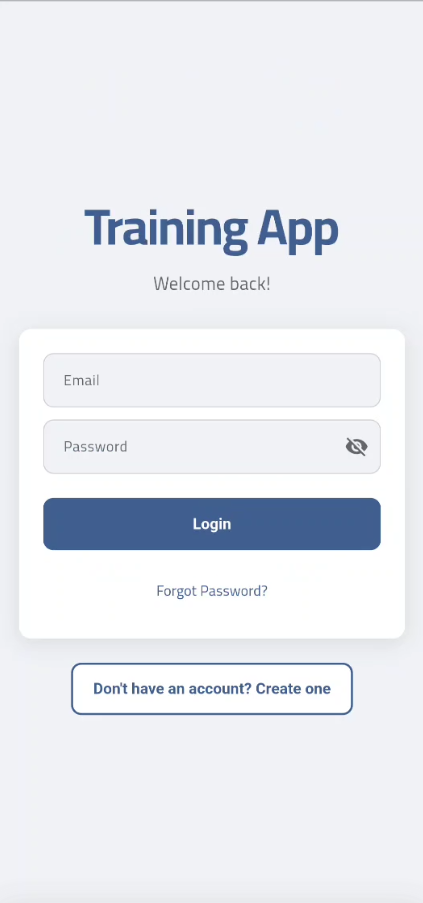<br/><b>Login Screen</b></td>	reviewerId, targetId, rating, comment, date

    <td>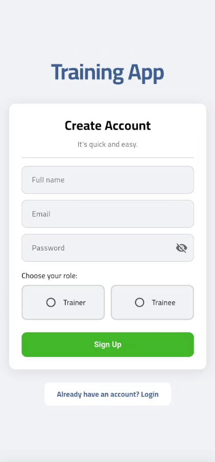<br/><b>Signup Screen</b></td>}

    <td>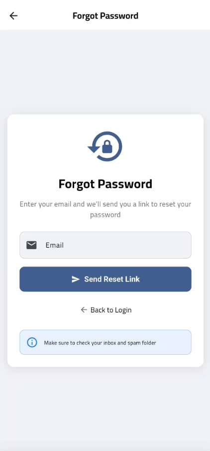<br/><b>Password Recovery</b></td>```

  </tr>

</table>### Badge Families Implemented

- Points: `points_100`, `points_500`, `points_1000`

### Main Dashboards- Daily Streak: `streak_3`, `streak_7`, `streak_14`, `streak_30`

<table>- Reviews Authored: `first_review`, `reviews_10`, `reviews_25`, `reviews_50`

  <tr>

    <td>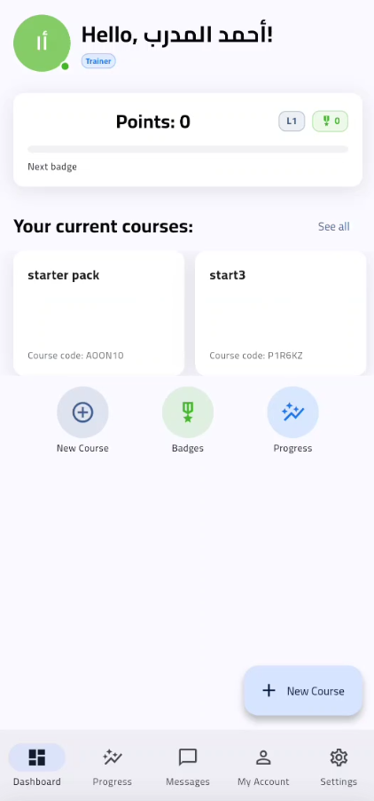<br/><b>Trainer Dashboard</b></td>Extensible (future): lesson count, quiz count, advanced streaks, social milestones.

    <td>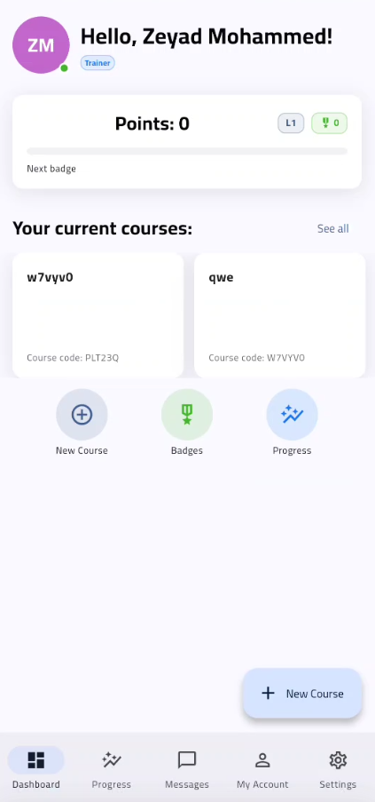<br/><b>Trainee Dashboard</b></td>

    <td>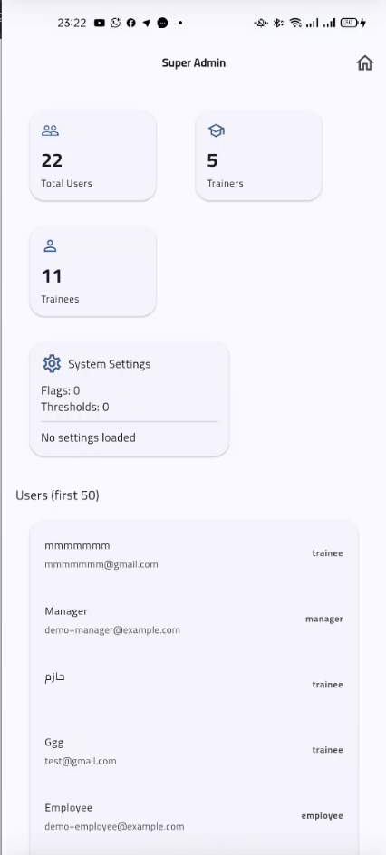<br/><b>Admin Dashboard</b></td>### Providers Overview (Riverpod)

  </tr>| Provider | Type | Purpose |

</table>|----------|------|---------|

| `pointsRepositoryProvider` | `Provider` | Data access for points & badge mutation. |

### Course Management| `userPointsStreamProvider(userId)` | `StreamProvider` | Live user gamification snapshot. |

<table>| `currentUserLevelProvider` | `Provider<int?>` | Derived level. |

  <tr>| `nextBadgeProgressProvider` | `Provider<Record>` | Remaining points to next threshold. |

    <td><br/><b>Course Catalog</b></td>| `nextBadgeProgressPercentProvider` | `Provider<double?>` | Normalized progress 0..1. |

    <td><br/><b>Course Details</b></td>| `earnedLockedBadgesProvider(userId)` | `FutureProvider<(earned,locked)>` | Partition badges. |

    <td>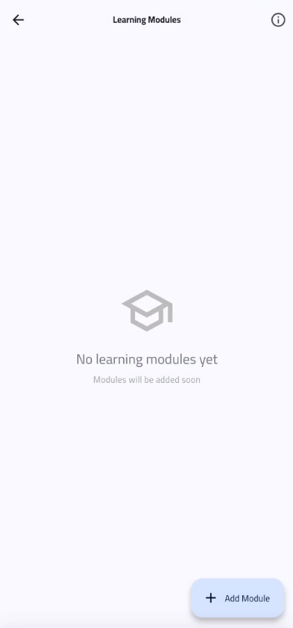<br/><b>Lesson Viewer</b></td>| `leaderboardEntriesProvider(limit)` | `FutureProvider<List<LeaderboardEntry>>` | Ranked list. |

  </tr>| `badgeAwardEventsProvider(userId)` | `StateNotifierProvider` | Emits newly earned badge IDs (debounced). |

</table>| `badgeAwardsHistoryProvider(userId)` | `StreamProvider<List<{badgeId,awardedAt}>>` | Timeline history. |

| `badgeIdToBadgeProvider` | `FutureProvider<Map>` | Map for quick id→Badge lookup. |

### Communication| `updateDailyStreakProvider` | `FutureProvider<void>` | Forces streak recalculation. |

<table>| `currentUserDailyStreakProvider` | `Provider<int?>` | Current streak value. |

  <tr>

    <td>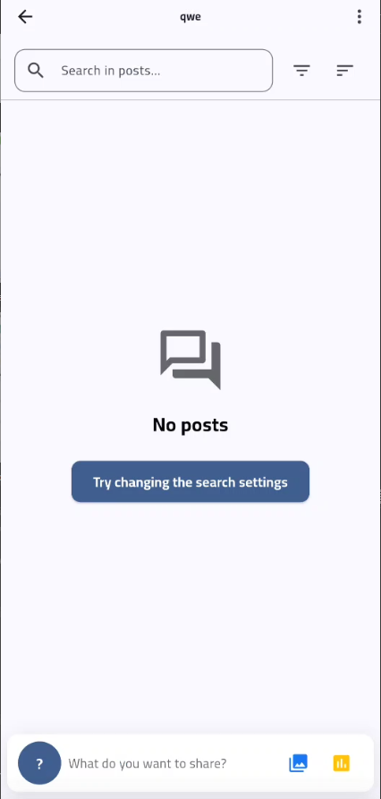<br/><b>Course Wall (Posts)</b></td>### Award Evaluation Flow

    <td>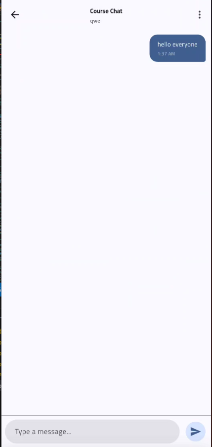<br/><b>Real-Time Chat</b></td>1. User triggers an action (e.g., lesson complete) → `grantPointsForEventProvider(PointEventType.lessonCompleted)`.

    <td><br/><b>Notifications</b></td>2. Points increment (transactional merge) + optional streak update.

  </tr>3. `BadgeEvaluationService.evaluateAndAward(userId)` runs:

</table>	 - Checks point thresholds.

	 - Checks streak thresholds.

### Gamification	 - Counts authored reviews for review badges.

<table>	 - Grants badges idempotently (transaction ensures no duplicates).

  <tr>4. Firestore stream updates → `badgeAwardNotifier` diffs previous vs current badge set → enqueues new IDs.

    <td>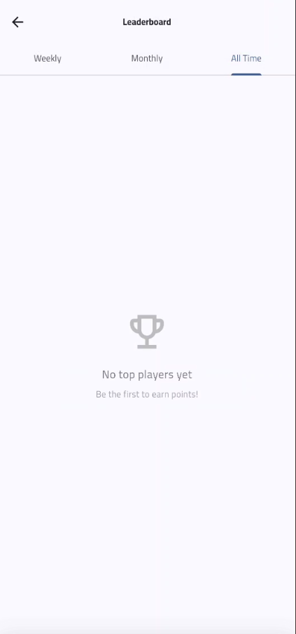<br/><b>Leaderboard</b></td>5. `BadgeAwardListener` (UI) batches notifications (debounced) & consumes queue.

    <td><br/><b>Badges Collection</b></td>

    <td>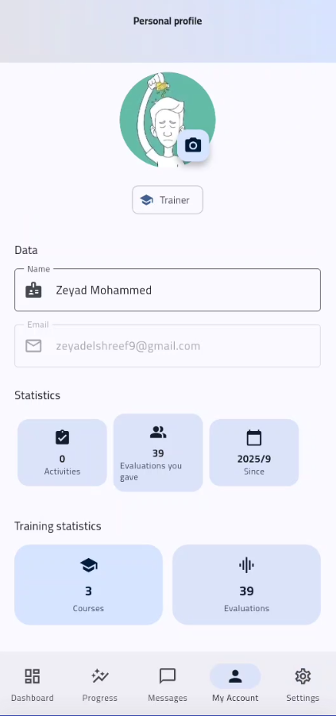<br/><b>User Profile</b></td>### UI Components

  </tr>- `PointsLevelCard` – points, level, progress bar, streak line.

</table>- `EarnedBadgesGrid` / `LockedBadgesGrid` – badge partition display.

- `BadgesOverview` – tabbed combined view.

### Dark Mode- `BadgeTimeline` – chronological awarded badges.

<table>- `BadgeAwardListener` – global snackbar feedback (supports batch message via localization key `badgesEarnedBatch`).

  <tr>

    <td>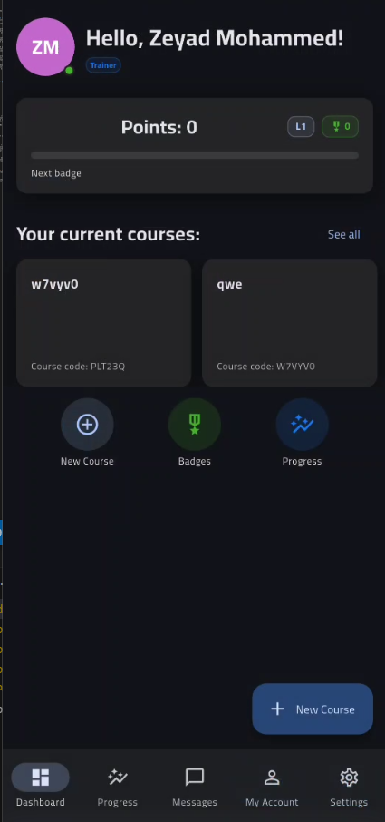<br/><b>Dark Mode Dashboard</b></td>### Testing Strategy

    <td>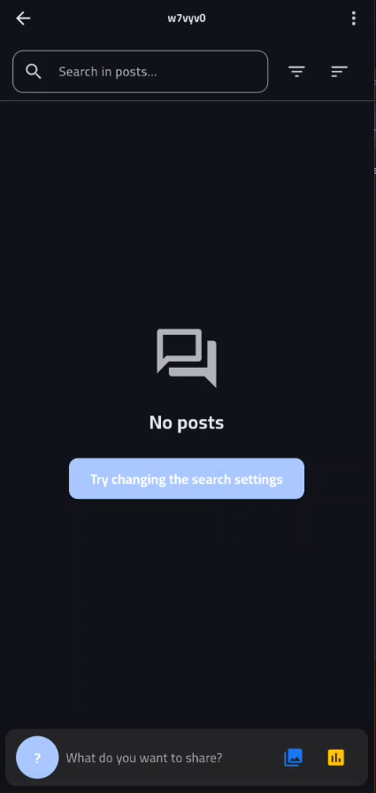<br/><b>Dark Mode Course</b></td>| Test | Focus |

    <td><br/><b>Dark Mode Chat</b></td>|------|-------|

  </tr>| `compute_level_test.dart` | Level math correctness. |

</table>| `badge_evaluation_service_test.dart` | Awarding point threshold badges. |

| `streak_badge_evaluation_test.dart` | Streak badge logic. |

> 📝 **Note**: Screenshots folder will be added soon with actual app images.| `review_badges_test.dart` | Review-authored badge logic. |

| `points_repository_badge_award_test.dart` | Idempotent badge transaction + timestamp. |

---| `badge_award_notifier_test.dart` | Detection of new badge IDs. |

| `badge_award_notifier_consume_all_test.dart` | Batch consume behavior. |

## 🎥 Demo Video| `badge_awards_history_provider_test.dart` | Ordering of award history. |

| `earned_locked_badges_provider_test.dart` | Partition correctness. |

### Watch Full Demo (60 seconds)

> 🎬 **Demo video coming soon!** Will showcase all major features.### Extending Badges

Add entries to service maps or externalize thresholds:

### What Will Be Shown:```dart

- ✅ User login and authentication flow// Example: add 25 & 50 review badges

- ✅ Trainer creating a coursestatic const _reviewBadges = <int,String>{

- ✅ Trainee enrolling and accessing lessons	1: 'first_review',

- ✅ Real-time chat and course wall interactions	10: 'reviews_10',

- ✅ Quiz taking and instant grading	25: 'reviews_25',

- ✅ Badges and leaderboard	50: 'reviews_50',

- ✅ Light/Dark mode switching};

- ✅ Responsive design on different devices```

Then seed `badges` collection documents accordingly.

---

### Future Ideas

## 🏗️ Architecture Highlights- Remote-configurable thresholds

- Seasonal / limited-time badges

### Clean Architecture Layers- XP decay for inactivity

```- Challenge quests & multi-step achievements

┌─────────────────────────────────────┐- Push notifications on significant milestones

│         Presentation Layer          │

│  (Screens, Widgets, State Mgmt)     │### Weekly Challenges (NEW)

├─────────────────────────────────────┤Server-managed recurring goals to drive short-term focus.

│         Business Logic Layer        │

│    (Providers, Use Cases, VM)       │Data Model:

├─────────────────────────────────────┤```

│            Data Layer               │weekly_challenges/{id} {

│  (Repositories, Models, DTOs)       │	title, description, targetType: 'points'|'quizzesPassed'|'tasksCompleted'|'attempts',

├─────────────────────────────────────┤	targetValue: number,

│         External Services           │	activeRange: { start: ISO8601, end: ISO8601 },

│ (Firebase, OneSignal, Storage)      │	active: boolean,

└─────────────────────────────────────┘	createdAt, updatedAt

```}

user_challenge_progress/{userId_challengeId} {

### Key Design Patterns	userId, challengeId, progress, target, completed, completedAt?, lastEval

- **Repository Pattern**: Data abstraction with `Result<T>` error handling}

- **Provider Pattern**: Riverpod for dependency injection and state management```

- **Factory Pattern**: Model serialization with Freezed

- **Observer Pattern**: Real-time Firestore streamsBackend:

- **Strategy Pattern**: Role-based UI rendering with `RoleGate`- Scheduled CF `evaluateWeeklyChallenges` computes progress once per day (MVP cadence).

- Callable `createWeeklyChallenge` (super_admin only) seeds a challenge.

### Firestore Structure- Callable `forceEvaluateChallenges` allows manual re-run.

```

institutions/Rules:

  └─ {institutionId}/- `weekly_challenges`: read all signed-in, writes super_admin only.

       ├─ companies/- `user_challenge_progress`: read own (or super_admin), server-only writes.

       │    └─ {companyId}/

       │         └─ departments/Next Iterations:

       ├─ courses/- Capture per-user baseline at challenge activation for delta-based progress.

       │    └─ {courseId}/- Real-time incremental updates via point/attempt triggers.

       │         ├─ lessons/- Challenge tiers & cohort / tenant scoped challenges.

       │         └─ quizzes/

       ├─ users/### Minimal Badge Document Seed

       ├─ enrollments/```

       ├─ chat_rooms/// badges/points_100

       │    └─ {roomId}/{ "name": "100 Points", "description": "Reach 100 total points", "iconUrl": "" }

       │         └─ messages/```

       └─ user_points/

```---


------


## 📊 Performance Metrics##  Installation & Setup


- **Cold Start Time**: < 2 seconds### Prerequisites

- **Screen Transition**: < 300ms- Flutter SDK (3.x or higher)

- **Firestore Query**: < 500ms (avg)- Dart SDK (3.x or higher)  

- **Image Load**: Cached in < 100ms- Firebase CLI

- **Chat Message Latency**: < 200ms- Node.js (for Cloud Functions)

- **Bundle Size**: ~18 MB (Android), ~25 MB (iOS)- OneSignal account


---### Quick Start


## 🌍 Supported Platforms1. **Clone & Install**

```bash

| Platform | Status | Notes |git clone https://github.com/zezo12322/training_app_v2.git

|----------|--------|-------|cd training_app_v2

| **Android** | ✅ Fully Supported | Android 5.0+ (API 21+) |flutter pub get

| **iOS** | ✅ Fully Supported | iOS 12.0+ |dart run build_runner build --delete-conflicting-outputs

| **Web** | ✅ Fully Supported | Chrome, Safari, Firefox, Edge |```

| **Desktop** | 🚧 In Progress | Windows, macOS, Linux |

2. **Firebase Configuration**

---   - Create Firebase project

   - Enable Authentication, Firestore, Storage

## 📦 Project Statistics   - Add google-services.json & GoogleService-Info.plist

   - Deploy indexes: `firebase deploy --only firestore:indexes`

```   - Deploy functions: `firebase deploy --only functions`

Total Screens: 50+

Reusable Widgets: 10+ shared components3. **Run**

Total Lines of Code: ~25,000```bash

Firestore Collections: 15+flutter run

Cloud Functions: 5+```

Security Rules Lines: 1,038

Test Files: 150+---

Documentation Files: 15+

Git Commits: 200+##  Testing

Development Time: 6 months (ongoing)

``````bash

flutter test                                    # Run all tests

---flutter test test/wall_filter_providers_test.dart  # Specific test

flutter analyze                                 # Code analysis

## 🏆 Project Highlights```


### Technical Excellence**Status**:  16/16 tests passing, 0 errors, 0 warnings

- ✅ Clean architecture with SOLID principles

- ✅ Comprehensive error handling with Result pattern---

- ✅ Type-safe state management with Riverpod

- ✅ Immutable data models with Freezed##  Performance

- ✅ Reactive programming with Streams

- ✅ Dependency injection throughout- **Image Compression**: 70% size reduction

- **Pagination**: 20 posts per page

### Code Quality- **Firestore Indexes**: 4 composite indexes for fast queries

- ✅ Dart Analyzer with strict mode- **State Management**: Efficient Riverpod caching

- ✅ Null safety enabled

- ✅ Consistent code formatting---

- ✅ Inline documentation

- ✅ Git commit conventions##  Documentation

- ✅ Code review ready

- [Development Summary](DEVELOPMENT_SUMMARY.md) - Detailed feature documentation

### Security & Performance- [Security Migration](docs/SECURITY_MIGRATION.md) - Security updates guide

- ✅ Enterprise-grade Firestore rules- [HRIS Import Guide](docs/HRIS_IMPORT.md) - Bulk user import documentation

- ✅ Multi-layer data validation- [BigQuery Export Guide](docs/BIGQUERY_EXPORT.md) - Data export setup and usage

- ✅ Optimized queries with indexes- [Anomaly Detection Guide](docs/ANOMALY_DETECTION.md) - ML-based anomaly detection system

- ✅ Image caching and lazy loading

- ✅ Memory leak prevention---

- ✅ Performance monitoring

**Version**: 2.0  

---**Last Updated**: January 2025  

**Status**: Production Ready 

## 📞 Contact & Collaboration

### About the Developer
I'm a Flutter developer specializing in full-stack mobile and web applications with Firebase backends. This project showcases my expertise in:

- ✅ Complex state management (Riverpod)
- ✅ Real-time data synchronization
- ✅ Multi-tenant architecture design
- ✅ Gamification systems
- ✅ Firebase security rules
- ✅ Clean code and architecture patterns

### Get In Touch
- 📧 **Email**: your.email@example.com
- 💼 **LinkedIn**: linkedin.com/in/yourprofile
- 🐙 **GitHub**: github.com/yourusername
- 📱 **WhatsApp**: +20 XXX XXX XXXX
- 🌐 **Portfolio**: yourportfolio.com

### Available For
- 💼 Full-time Flutter development positions
- 🤝 Freelance mobile app projects
- 🎓 Training and mentorship
- 💡 Code review and consulting
- 🚀 Startup technical partnerships

**📩 Interested in working together? Let's connect!**

---

## 📄 License & Copyright

**Proprietary License**

© 2025 All Rights Reserved.

This project is proprietary software. The source code is **not publicly available** to protect intellectual property. This README serves as a portfolio demonstration showcasing technical capabilities and project scope.

**For licensing inquiries, partnership opportunities, or source code access requests, please contact the developer directly.**

---

## 🙏 Acknowledgments

- **Flutter Team**: For the amazing cross-platform framework
- **Firebase Team**: For robust backend infrastructure
- **Riverpod**: For excellent state management solution
- **Freezed**: For immutable data classes
- **Design Inspiration**: Material Design 3, Facebook, LinkedIn, Udemy, Duolingo
- **Community**: Flutter Discord, Stack Overflow, GitHub discussions

---

<div align="center">

**Made with ❤️ using Flutter & Firebase**

*Building the future of digital learning*

⭐ Interested in this project? **Get in touch!**

</div>
